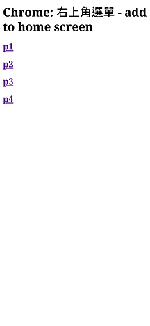
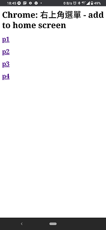
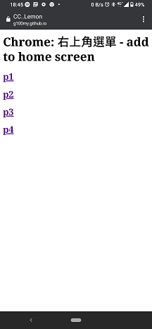
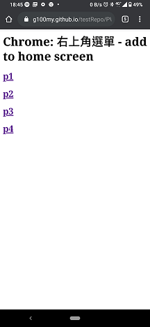
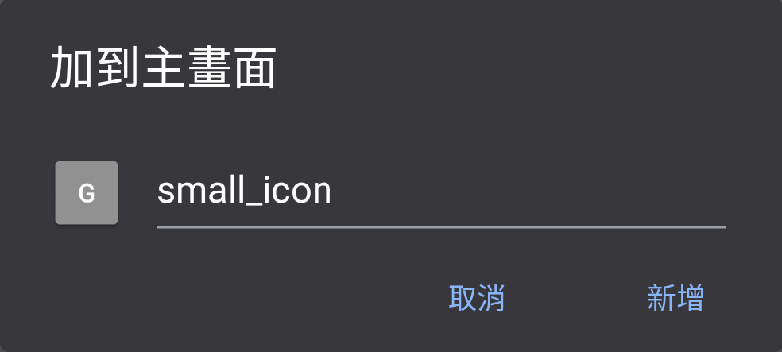

## manifest 有沒有 domain 限制？

沒有，每個 html 都可以 link 一個 manifect.json，只需要有

	<link rel="manifest" href="manifectFile/m1.json">

如果有重複多項 link 會選擇第一項執行。
不同 page 連到同一個 manifect 是可以的。

---------------------------------------------------------------------

## display 的四個 mode##

* fullscreen
全屏幕，手機常駐在最上面的狀態欄、底下螢幕功能虛擬功能鍵都不會有。
全屏幕看起來很炫，但是就要讓使用者知道怎麼呼叫出隱藏起來的狀態欄和虛擬功能鍵（螢幕邊緣上下滑），或者在網頁內設置上一頁、關閉網站等網頁版的功能鍵。不然使用者很有可能會不知道怎麼退出...

* standalone
保留有狀態欄和虛擬功能鍵，看起來跟一般 APP 一樣。

* minimal-ui
畫面是 WebView，常見在其他 app，如 Facebook app 內點擊不屬於 facebook 的網頁連結，預設以 WebView 開啟。

* browser
一般瀏覽器的畫面。

---------------------------------------------------------------------

## icons 可以塞 n 個值，那麼使用 / 選用的邏輯（搭配 purpose？）##

根據螢幕大小，瀏覽器會自己依據需要顯示 icon 的畫面大小匹配最適合的圖示大小。

測試時用了 6 種不一樣大小的 icons size的值、圖檔，
大小分別為 24 32 64 128 256 512，用模擬器分別選用不同的 Resolution 

|模擬器螢幕大小	|Home screen 上匹配到的 icon size	|Splash screen 上匹配到的 icon size	|
|:--------------|:----------------------------------|:-----------------------------------
|240x320		|64x64								|128x128							|
|480x800		|128x128							|256x256							|
|2200x2480		|128x128							|512x512							|
|1080x1920		|128x128							|512x512							|

在 add to Home screen，sizes 的值或者圖片本身大小小於 48x48 都無法正常顯示。
**48**是個 **magic number**，在找最後一個問題答案時才發現這個驚人的事情，[Audit: icon size coverage] 和下面一樣）

---------------------------------------------------------------------

## （可能是 icons 的延伸）在按下 home 的 icon 到真正網頁出來之間還會卡一個畫面（有沒有正式的名稱？） ##

正式名稱： splash screen / launch screen
參考 [Developers Google - The Web App Manifest](https://developers.google.com/web/fundamentals/web-app-manifest#splash-screen)

---------------------------------------------------------------------

## 這個格式有辦法改嗎？如果不能改，靠 icon 能作到什麼程度？ ##

目前沒有看到任何方法可以處理。
靠 icon 最多就是讓 user agent （瀏覽器）「不得已」選擇比較大的圖。

[Progressive Web App icon on splash screen is extremely small](https://stackoverflow.com/questions/49406978/progressive-web-app-icon-on-splash-screen-is-extremely-small)

[Audit: icon size coverage]

[Audit: icon size coverage]: https://github.com/GoogleChrome/lighthouse/issues/291

