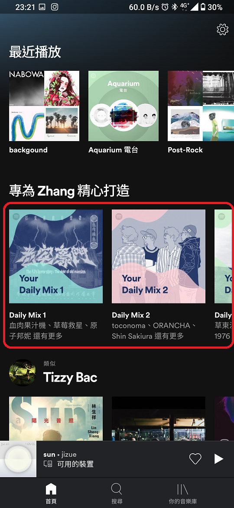
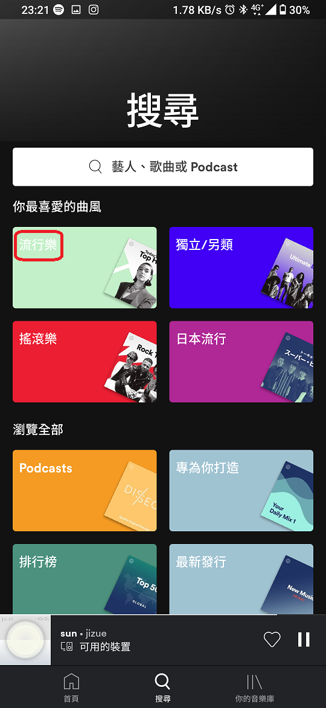
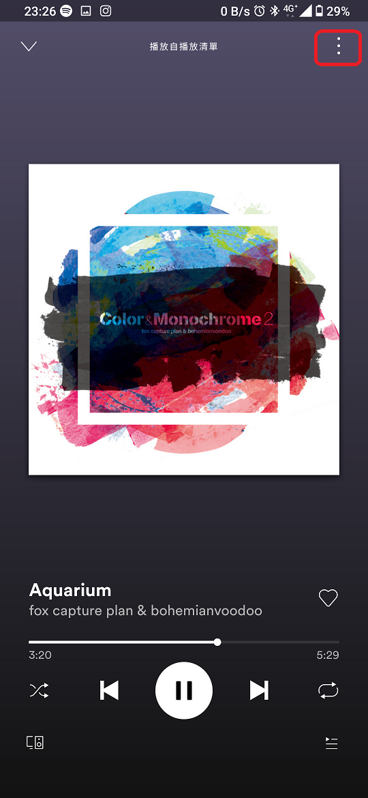
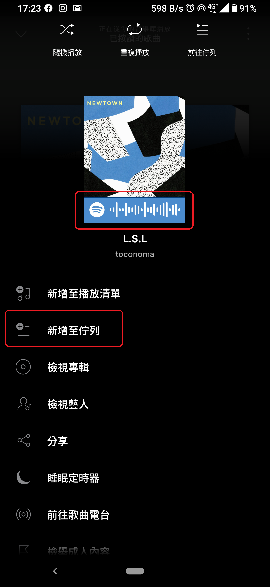
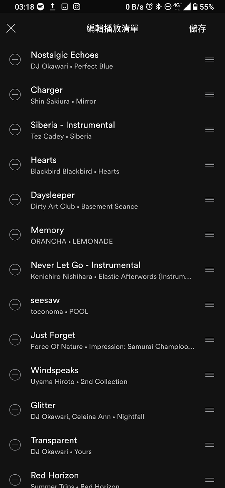
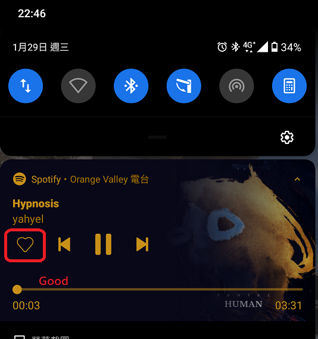

# 以 UI 角度評論 Spotify 手機 App 的優缺點 #

## 外觀方面 ##

### 缺點：###

1. 如左下圖示，很多功能都藏在右上角的選單內，介面外觀簡單俐落，但是缺點是不好按又沒有其他呼叫選單的方式...尤其現在手機這麼大一隻，不是很方便
1. 如右上圖示，搜尋頁的字體統一都是白色，有時搭配上較為淺色的背景會看不到文字。

### 優點：###

1. 如左上圖示，善用專輯封面做成 Daily Mix、曲風分類清單 的選項圖案，外觀感覺有質感，可以從該圖示大致上得知裡面的歌曲內容是什麼風格，底下也有縮小字體簡略說明裡面的歌手/樂團有誰、或者該清單的曲風是什麼，且因為推薦內容會隨著 時間 / Data mining / 新作品發佈 而更換，因此每次打開 app 首頁所看到的都會不大一樣，會讓人感到新奇。
2. 如左下圖播放頁的背景顏色會隨著專輯封面的主要配色做更換，如該圖範例撥放時，背景是漸層的紫色。
4. 如右下圖示，部分音樂會有簡短MV，有時候會讓你捨不得把手機螢幕關掉。

---------------------------------------------------------------------

## 介面功能方面 ##

### 缺點： ###

1. 圖左上和右上，頂端搜尋列的相機掃碼功能至今從來沒有用過，甚至我從來沒注意過哪裡可以產生歌曲/播放清單的條碼，為了寫這個作業才仔細翻了一下，原來是藏在按下右上角選單裡，只能截圖存檔無法輸出成圖檔，不然就是要當面分享一個人開啟該條碼給另一個人掃描。把這項功能換成語音搜尋不是比較好...? 像是結合 Shazam 等錄下一段音樂可以搜尋是哪一首歌，或者做成 google 語音搜尋都比掃碼實用多了...
1. 如左中，編輯播放清單頁面可以多選、拖曳排序，但是在排序僅能單一排序不能多個項目一起拖曳排序。
1. 手機版無法查看其他朋友現在正在聽什麼音樂，僅能查看開放的播放清單，且追蹤朋友這功能在手機版本藏在首頁右上角設定->個人資訊->正在關注，在電腦版才有支援。無法查看導致"追蹤朋友/藝人"這個功能好像不存在一樣。
1. 感覺 data mining 做得不錯，個人認為分析結果滿準的。很簡單的就能從一首歌曲的*音樂電台*進一步地找到其他相同曲風或是相同調性的音樂，或者在已經建立的私人歌單中，底下會有依據已經建立的播放清單內容推薦相似的歌曲。
不過感覺這是雙面刃，猜測使用者的喜好這方面滿精準的沒錯，但是準過頭也是困擾，首頁滿滿滿相關的推薦音樂或者關聯音樂，有時候也會想要聽些不一樣的音樂啊...立刻想到荒廢已久、同溫層厚到炸裂的 Facebook...

### 優點： ###

1. 如右上圖示，新增至佇列功能很棒，像是KTV＂插歌＂一樣，有時候並不是想要把目前的播放清單整個換掉，而是只想要插幾首選定的歌曲/一張專輯進去目前的播放佇列中而已。
1. 如右下圖示，下拉快捷狀態欄有清晰好使用的基本播放元件圖示，還有收藏用的愛心，在收聽電台時或者盲目的隨機播放時很好用。使用專輯封面做漸層背景也是在視覺上很加分的地方。

---------------------------------------------------------------------

